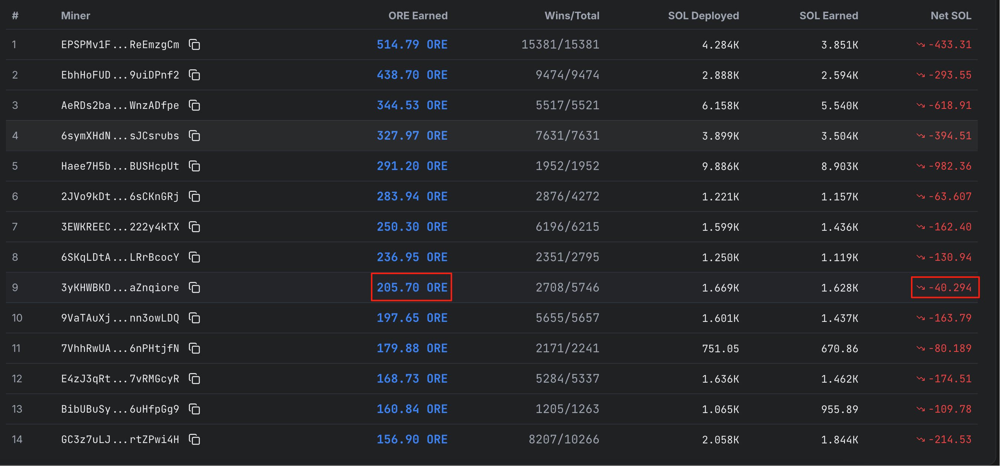

# ORE REFINED

ORE Refined is a mining program optimized for ORE, helping you maximize the conversion of ORE to unclaimORE.

### How does it work？
The project is divided into two parts: the off-chain program and the on-chain program. This project is the off chain program and is 100% open source. The onchain program is closed source code.  the mine parameter will be passed to the onchain program, and ultimately the onchain program will calculate the EV and deploy the SOL.

### Why should I use this project to refined ORE
If you want to maximize your ORE to unclaimed ORE conversion rate, you need to deploy sol at the squares of the best EV. Calculating EV and deploying square to the optimal EV is a complex process. ORE REFINED will do it for you.

### Fee
0.5% of the deploy amount. All the fees will be used to purchase ORE or converted to unclaimed ORE. Unlocked until January 1, 2027.1

Compared with random deployment or uniform deployment to all squares, the increase in EV is far greater than the fee

The miner "iore" with the highest conversion rate was created by me

### How to use it
1.clone and build the project

2.run the following command
```sh
./ore-refined  --rpc YOUR_RPC_ADDRESS --keypair YOUR_SOLANA_KEYPAIR_PATH --per-round-deploy-amount AMOUNT
```

### Mining optimization parameters

#### 1. remaining_slots
This means that the slot must be deployed in the final few slots. For example, if this parameter is set to 5, it will only be deployed on the last 5 slots of each round (each slot is approximately 400ms). Since the EV of square will still change due to the deployment of others after the SOL is deployed, the later the deployment, the more it can ensure that it is deployed on the square with the best EV. However, if the secondary parameter is set too low, some rounds may be missed (the transaction land takes some time).

#### 2. ore_refined_rate
This parameter represents how many ores are expected to be converted to 1 unclaimed ORE. For example, setting this to 1.3 means that you can accept 1.3 ORE converted to 1 unclaimed ORE. So it means that if the current round is very popular, a poor EV leads to a conversion rate exceeding 1.3. Then SOL will not be deployed. So the higher this parameter is set, the higher the probability of deployment (a worse EV can be accepted), and the faster the conversion speed will be. If this parameter is set lower, the probability of deployment will be lower (only relatively better EVs will be accepted), and the conversion speed will be worse.
